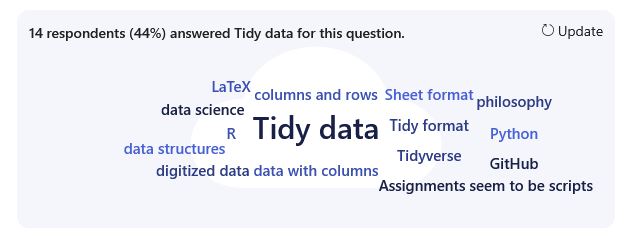
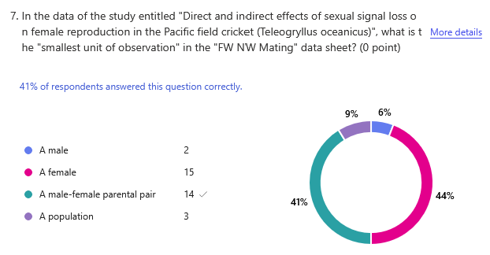
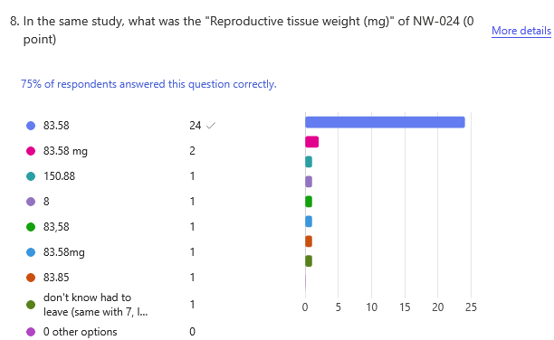

# Week01 UNIX

> [!IMPORTANT]
> [Assignment 0](../assignments/assignment_0_2026.md) is due at the beginning of this lecture

> [!NOTE]
> The [Lecture Stream 2025](https://tamucc.zoom.us/rec/play/UhvJmtYJYRIVJ1ifqNm_Xj0n1ytptIXmbL-ggFJbbH9Cn3D34PNxkhQBUbnAJcotQFlBtry3XH__UYs7.k3kF7aFG1KF6Ks98) will be updated following lecture.
> Passcode: MCTiZC0*

> [!NOTE]
> I have converted the [Lecture 01 Slides](Week01_files/Lecture01_WelcomeToTheMatrix.pdf) to a more screen-splitting friendly format below.

<hr style="height: 3px; border: none; background-color: black;">

## Computer Preparation

Before class, complete the [Computer Setup Checklist](../resources/computer_setup_checklist.md).

Confirm that your terminal, Git, and the `~/CSB` repository work before continuing.

---

## [Lecture 1 Quiz](https://forms.office.com/r/VJiCRGyzcP)

Complete the quiz while your computer is updating

---

## Discussion of Reading Assignment 1: [Wickham 2014](../literature/Wickham_2014_Tidy_Data.pdf)


<details><summary>What is the main point of the Wickham 2014 manuscript?</summary>
<p>


- Tidy data provides a consistent framework for organizing data so that it is easier to analyze.
- The central rules identified were that variables should be columns, observations should be rows, and observational units should be organized into appropriate tables.
- Data cleaning/tidying is an important part of analysis that often receives less attention than statistical analysis itself.
- Standardized data structures make it easier to manipulate data with computational tools.

 </p>
</details>

<details><summary>What do you like about the Wickham 2014 manuscript?</summary>
<p>


- The examples, figures, and tables were widely viewed as helpful for understanding otherwise abstract concepts.
- Relatively simple and organized explanation of tidy versus messy data.
- The examples showing how datasets can be reshaped or "melted" were particularly useful.
- Some students connected strongly with the discussion because of prior experience spending substantial time cleaning datasets.
- The manuscript's explicit rules and standards for organizing data were viewed as useful guidance for creating reproducible and manageable datasets.

 </p>
</details>

<details><summary>Do you disagree with Wickham 2014 on any of their points?</summary>
<p>


- Most did not substantially disagree with the overall principles of tidy data.
- Some questioned whether tidy data is always the most appropriate structure for every type of dataset or scientific field.
- Some students felt that separating data into multiple tables and later joining them can seem unnecessarily complicated or redundant.
- There was some concern that there may be multiple valid approaches to producing "clean" data rather than a single universal format.
- Overall, students generally accepted the value of standardized and well-organized data even when questioning specific implementation choices.

 </p>
</details>

<details><summary>What was confusing or do you have any questions about Wickham 2014?</summary>
<p>


- R syntax and some of the programming examples were difficult for students without previous R experience.
- Several students were unsure about when and why a dataset needs to be "melted" or reshaped.
- The modeling section and terminology associated with statistical models were confusing to some students.
- Students had questions about how computers interpret structured data differently from humans.
- Filtering and manipulating datasets programmatically was identified as an area where additional practice would be useful.
- Some students were interested in learning about alternative frameworks for data cleaning and organization.

 </p>
</details>

---

## Discussion of Reading Assignment 1 part 2: [Intro to GitHub](https://classroom.github.com/a/C_SLS9P8)

<details><summary>Do you have any questions about the Intro to Github reading?</summary>
<p>


- Most students reported no specific questions at this point.
- Several indicated that questions will probably arise once they begin using GitHub in practice.
- One student asked about the difference between **Issues** and **Pull Requests**.
- Some students noted that they are still becoming familiar with GitHub terminology.
  
<details><summary>**Fork vs. clone vs. branch:** what each is for and when to use which.</summary>
<p>

# Fork

* **What:** Your own copy of *someone else’s GitHub repo* under your account.
* **Where it lives:** On GitHub.
* **Why:** Propose changes to a repo you don’t own (via Pull Request).
* **Typical flow:** *Fork → clone your fork → branch → commit/push → PR to upstream.*
* **Key cmd(s):**

  * *(on GitHub UI)* “Fork”
  * `git remote add upstream https://github.com/original/repo.git`
  * `git fetch upstream && git merge upstream/main` (keep fork updated)

# Clone

* **What:** Download a remote repo (yours or someone else’s) to your computer.
* **Where it lives:** On your machine.
* **Why:** To work locally.
* **Key cmd:** `git clone https://github.com/user/repo.git`

# Branch

* **What:** A lightweight line of development *inside a single repo*.
* **Where it lives:** In your local repo (and on remote once you push).
* **Why:** Isolate work without breaking `main`.
* **Key cmd(s):**

  * `git switch -c feature-x` (create & switch)
  * `git push -u origin feature-x` (publish branch)

---

### Quick choose

* **I want my own copy of a public project to contribute back:** **Fork** (then clone it).
* **I just need the code on my laptop:** **Clone**.
* **I’m adding a feature or fixing a bug without touching main:** **Branch**.

### Mini map

```
GitHub (original) ──(Fork)──> GitHub (your fork) ──(Clone)──> your laptop
		                                 └─(Branch)─> feature-x
```
</p>
</details>
  

<details><summary>**GitHub vs. cloud drives:** how version control differs from typical file storage.</summary>
<p>

### GitHub (version control) vs. Cloud drives (file storage)

**What it is**

* **GitHub:** A *version control* host. Tracks every change as a commit with author, time, and message; supports branches, merges, and code review.
* **Cloud drive (e.g., Google Drive/OneDrive/Dropbox):** A *file syncing/storage* service. Keeps files in the cloud and on devices; may keep limited, opaque version history.

**How changes are tracked**

* **GitHub:** Explicit snapshots (`add` → `commit` → `push`). Each commit is permanent, diffable, and attributable.
* **Cloud drive:** Auto-save overwrites the file; version history exists but is not designed for branching/merging workflows.

**Working in parallel**

* **GitHub:** Create **branches** for independent work; merge with a **pull request**; resolves conflicts line-by-line with diffs.
* **Cloud drive:** Either live co-editing (Docs/Sheets) or last-writer-wins for files; no true branching or structured merges.

**Review & accountability**

* **GitHub:** Pull requests, inline comments, required reviews, CI checks; `blame` to see who changed what, when, and why.
* **Cloud drive:** Comments on documents, but no repo-wide review gates or commit metadata.

**Reproducibility**

* **GitHub:** You can check out *any* commit/tag and rebuild exactly; great for code, data pipelines, and manuscripts under source control.
* **Cloud drive:** You can revert versions, but reconstructing precise states across many files is harder.

**File types**

* **GitHub:** Best for plain text (code, Markdown, CSV). Large/binary files (videos, PSDs) are harder; use Git LFS or a drive.
* **Cloud drive:** Fine for big/binary files and WYSIWYG docs; not ideal for code collaboration.

**Offline & syncing**

* **GitHub:** Work offline; sync intentionally with `push`/`pull`.
* **Cloud drive:** Syncs automatically; edits depend on app support for offline.

---

## When to use which

* **Use GitHub** for code, scripts, text-based writing, datasets you want diff/merge, collaboration via branches/PRs, and reproducible snapshots.
* **Use a cloud drive** for large binaries, drafts that need rich WYSIWYG co-editing, or assets not suited to diffs.

---

## One-liner students can remember

* **Drive = share & sync files.**
* **GitHub = *track, branch, review,* and reproduce changes to files.**
</p>
</details>


<details><summary>**Collaboration scale:** small teams vs. large open-source workflows.</summary>
<p>

yes

</p>
</details>
  
  
<details><summary>**Beginner essentials:** which **commands/habits** to master first.</summary>
<p>

# core loop

**Commands**

* `git status` — see what changed.
* `git add <file>` / `git add .` — stage changes.
* `git commit -m "Do one thing"` — save locally.
* `git push` — publish to GitHub.
* `git pull --rebase` — get latest cleanly.

**Habits**

* Make **small commits** (one logical change).
* Write **imperative messages**: “Add README section”.
* Run code/tests **before push**.

---

# branches & review

**Commands**

* `git switch -c feature-x` — create & move to a branch.
* `git switch main` / `git pull --rebase` — update main.
* `git merge feature-x` (or PR on GitHub) — bring work in.
* `git log --oneline --graph --decorate --all` — visualize history.
* `git diff` — review what you’re about to commit.

**Habits**

* **One branch per task.**
* Open **small PRs**; ask for one review.
* Add a **.gitignore** early.

---

# safe fixes & sync

**Commands**

* `git restore <file>` — discard unstaged edits to a file.
* `git restore --staged <file>` — unstage.
* `git commit --amend` — fix last commit (only if not pushed).
* `git revert <sha>` — undo a bad pushed commit (safe).
* `git fetch` / `git remote -v` — see & update remotes.

**Habits**

* **Never commit secrets** (use env vars).
* **Pull before you push** on shared branches.
* Skim the **diff in the PR**; explain *why* in the description.

---

## One-minute workflow (post-setup)

```bash
git switch -c feature-x
# edit files
git status
git add .
git diff --staged        # quick self-review
git commit -m "Implement feature X"
git push -u origin feature-x
# open PR on GitHub
```

> Memory hooks: **status → add → commit → push**, small steps, clear messages, branch per task, review before merge.

</p>
</details>
	

 </p>
</details>

---

## Review Quiz 0

<details><summary>click to expand</summary>
<p>







 </p>
</details>

---

## Review Assignment 0

<details><summary>click to expand</summary>
<p>

### Assignment Steps

1. Accept the assignment and create your personal repository on GitHub.
2. Copy the **SSH address** of your personal repository.
3. Open a Bash terminal on your computer.
4. Move to your home directory:

   ```bash
   cd ~
   ```

5. Clone your personal repository and give the local clone the standardized name `assignment-0`:

   ```bash
   git clone YOUR-COPIED-SSH-ADDRESS assignment-0
   ```
   
6. Enter the cloned repository:

   ```bash
   cd assignment-0
   ```
   
7. Work through the assignment using the supplied `shell-lesson-data` directory.
8. Create and organize files inside `shell-lesson-data/student-work`.
9. Use Git to record your work locally and push it back to GitHub.
10. Verify on GitHub that your changes were successfully submitted.

> [!IMPORTANT]
> The repository on **GitHub** and the clone on **your laptop** are two different copies of the repository. Changes made on your laptop do not appear on GitHub until you `commit` and `push` them.

---

### Bash Commands Introduced in Assignment 0

You used several commands for navigating and working with files and directories:

| Command | Purpose                                         |
| ------- | ----------------------------------------------- |
| `pwd`   | print the path to the present working directory |
| `ls`    | list files and directories                      |
| `cd`    | change directories                              |
| `mkdir` | create directories                              |
| `nano`  | create or edit text files                       |
| `cp`    | copy files or directories                       |
| `mv`    | move or rename files or directories             |
| `rm`    | remove files                                    |
| `man`   | view the manual for a command                   |

You also learned some important path shortcuts:

| Path | Meaning                       |
| ---- | ----------------------------- |
| `~`  | your home directory           |
| `.`  | the present working directory |
| `..` | the parent directory          |

---

### Relative and Absolute Paths

An **absolute path** specifies the complete location of a file or directory beginning at the root of the filesystem.

For example, an absolute path might look something like:

```text
/home/username/assignment-0/shell-lesson-data
```

or on a Mac:

```text
/Users/username/assignment-0/shell-lesson-data
```

The exact path differs among computers.

A **relative path** specifies a location relative to your present working directory.

For example, if you are inside:

```text
assignment-0/shell-lesson-data/exercise-data
```

then:

```text
../north-pacific-gyre
```

means:

1. `..` — go up one directory to `shell-lesson-data`
2. enter `north-pacific-gyre`

Relative paths are extremely useful because the same command can work on different computers even when the absolute locations of the files differ.

---

### Git & GitHub Repository Synchronization

**git add** — “stage it”

* Tells Git *which* changed files you want in the next snapshot.
* Think: “include this in my next save.”
* Examples:
  `git add file.txt` (one file)
  `git add .` (everything that changed)

**git commit** — “save it (locally)”

* Creates a snapshot of the staged changes *in your computer’s repo* with a message.
* Doesn’t upload anywhere yet.
* Example:
  `git commit -m "Add data loader and tests"`

**git push** — “share it (to GitHub)”

* Sends your local commits to the remote repo (e.g., GitHub).
* First time on a branch, set the upstream:
  `git push -u origin main`
  After that:
  `git push`

**Quick workflow**

```bash
# make edits
git status          # see what's changed (optional but helpful)
git add <files>     # stage changes
git commit -m "Concise, meaningful message"
git push            # publish to GitHub
```

Tip for messages: use active, present tense (e.g., “Fix typo,” “Add README section”).

 </p>
</details>

---

## Text Book Vs. Lecture Slides

<details><summary>click to expand</summary>
<p>

* The [**Lecture_01 Slides**](Week01_files/Lecture01_WelcomeToTheMatrix.pdf) closely follow the book but there is some additional information that is not provided in the book (and vice versa). In the lecture slides, the `code blocks` are represented by green text on a black background, mimicking the terminal.

</p>
</details>

---

## Lecture: Unix, Linux, & the Command Line Interface (CLI)

> [!TIP]
> You can refresh your webpage to collapse expanded sections if you get "lost" 

<details><summary>Introduction</summary>
<p>

### [Linux](https://en.wikipedia.org/wiki/Linux) is a Free & Open Source Version of the [UNIX](https://en.wikipedia.org/wiki/Unix) Operating System


* An [operating system](https://en.wikipedia.org/wiki/Operating_system) is the primary interface between you and the computer

* [Open source](https://en.wikipedia.org/wiki/Open_source) is a decentralized development model where all aspects of a project are viewable and generally free to use

* Linux is free

  * [Supercomputers](https://en.wikipedia.org/wiki/Supercomputer) typically use it

  * Useful text manipulation tools

---

### CLI and GUI are the 2 Primary Methods of Interfacing with Computers

#### 1. Graphical User Interface ([GUI](https://en.wikipedia.org/wiki/Graphical_user_interface))

  A mouse or your finger is used to interface with images on a screen.

  

  


#### 2. Command-line Interface ([CLI](https://en.wikipedia.org/wiki/Command-line_interface))

  A keyboard is used to type commands into the computer and computer gives feedback on the screen.

  

  

---

### Why use [CLI](https://en.wikipedia.org/wiki/Command-line_interface) Linux?


* Free

* Automation

* Flexibility

* Powerful

* Designed for developers

* Supercomputers use it

* Many software tools for biologists

* Large body of support online

---

### The [UNIX Philosophy](https://en.wikipedia.org/wiki/Unix_philosophy)


* One program ([command](https://en.wikipedia.org/wiki/List_of_Unix_commands)) does one thing

* All programs accept input as a [text stream](https://en.wikipedia.org/wiki/Standard_streams) and output a modified text stream

* Programs can be linked together into serial [pipelines](https://en.wikipedia.org/wiki/Pipeline_(Unix)) to apply complex modifications to the text stream without saving to disk

---

### Documentation of Linux [CLI](https://en.wikipedia.org/wiki/Command-line_interface) Pipelines Facilitate Scientific Reproducibility and Long-Term Efficiency

Comparison of [GUI](https://en.wikipedia.org/wiki/Graphical_user_interface) and [CLI](https://en.wikipedia.org/wiki/Command-line_interface) for manipulating data


---


</p>
</details>

<details><summary>Getting Started with Unix</summary>
<p>

### Open A Terminal Window

Windows:  Search Windows Terminal and Open


<details><summary>Adjusting Windows Terminal Settings</summary>
<p>

Windows: Make Ubuntu the default terminal app


Windows: Ubuntu settings can be adjusted, such as startup dir


</p>
</details>

MacOS: Search Terminal and Open


---

### The [Directory Structure](https://en.wikipedia.org/wiki/Directory_structure) is the Organization of Files and Folders (aka Directories) In Your Computer

WIN10 File Explorer


Ubuntu Terminal


> &#x2757; IMPORTANT!: The CLI forces you to start memorizing where your files are and what they are named. This causes 95% of the difficulties in learning CLI, so start memorizing your directory structure.  It is also a good idea to be deliberate and organized when creating new directories and files.

> &#x1F4A1; TIP!: We will use [code blocks](https://en.wikipedia.org/wiki/Block_(programming)) to let you know when and what to type into your CLI. Here, please enter the commands `pwd` and then `ls` into your terminal.

```bash
pwd
ls
```

`pwd` lists the present working directory, `ls` lists the contents of the present working directory

> &#x1F4A1; TIP!: clear the screen with `ctrl + L` keystroke

---

### Unix/Linux Command Line Terminology

The [path](https://en.wikipedia.org/wiki/Path_(computing)) is the address of a file or directory in the directory structure


---

### Some Notable Directories (do not modify files here)

`/bin` contains several basic commands

`/dev` Contains the files connecting to devices such as the keyboard, mouse, and screen

`/etc`Contains configuration files

`/tmp` Contains temporary files

Try using `ls` to view these directories

```bash
ls /bin
ls /dev
ls /etc
ls /tmp
```

---

### Your Home Directory

`/home/<your-username>` (Linux) `/Users/<your-username>` (Mac) or is the directory where you are expected to create and maintain your directories and files.

  &#x1F4A1; TIP!: `<your-username>` should be replaced with your personal username.  don't include the `<>`
  
  * Starting directory upon login

  * Specific to user

  * Place for personal files, dirs, programs, downloads etc

`$HOME` is a [variable](https://en.wikipedia.org/wiki/Variable_(computer_science)) that contains the path to your home directory

  * A variable stores information

  * A variable is always preceded by a `$` after it is created

  * `$HOME` is an environmental variable created by the operating system and `bash`
  
  &#x1F4A1; TIP!: a shortcut for `$HOME` is the `~` character located at the upper left of your keyboard
  
  * the `echo` command can be used to show the contents of a variable, such as `$HOME`

```bash
echo $HOME
pwd
ls
ls $HOME
ls ~
```

---

### The Directory Tree


The directory tree is a map of the directories and files on your computers hard drives and/or solid state drives

If you have Ubuntu or a Mac with `homebrew` or some other linux package manger, you can install `tree` to view portions of your directory tree in "tree" format.

```bash
# this is a comment, as indicated by the # at the beginning of the line.  Do not type it into your terminal

# change directories 


# Ubuntu Only
sudo apt install tree

# Mac with homebrew only
brew install tree
```

We just installed the `tree` command (or app) from the internet to your computer.  If you were not able to do this because you did not install `homebrew` on your mac, it is ok. `tree` is not a critical command

```bash
# this will only work if you have tree installed, it is just an example so do not worry if you do not have it
cd ~
tree 
tree -L 1 
tree -L 2 
man tree
```

The `man` command is nearly universal in displaying the manual for "commands" such as `tree`. Use the `q` keystroke to exit the manual for tree.

```bash
# set up assignment 0 in your Ubuntu/Mac terminal on your laptop (not codespaces)
cd ~
mkdir Desktop
wget https://swcarpentry.github.io/shell-novice/data/shell-lesson-data.zip
unzip -d Desktop shell-lesson-data.zip

# check your directory structure for assignment_0
tree ~/Desktop/shell-lesson-data
```

It should look like this:


---
<!--  
### The `CSB/unix` [Repository](https://en.wikipedia.org/wiki/Repository_(version_control))

Our primary text book, [Computing Skills for Biologists](https://computingskillsforbiologists.com/), provides a rich assortment of resources for you.  Most of these resources are contained in a GitHub repository that you have cloned into your home directory.  This is the `CSB` directory. 

The `CSB` directory is organized by topic, with subdirectories dedicated to different chapters.  The directory for chapter 1 is `CSB/unix`.

`CSB/unix/data` Contains data for examples and exercises

`CSB/unix/installation` Contains instructions for installing software for this chapter

`CSB/unix/sandbox` Dir where we work and experiment

`CSB/unix/solutions` Solutions in code (`bash`) pseudocode (plain English) for your consultation when you get stuck with an exercise

```bash
# I am adding the 'cd ~' command to make sure you are in your home dir before running the 'ls' commands
cd ~
ls CSB/unix/
ls CSB/unix/data
ls CSB/unix/installation
ls CSB/unix/sandbox
ls CSB/unix/solutions
```

---

-->

</p>
</details>

<details><summary>The Shell</summary>
<p>

### The [Shell](https://en.wikipedia.org/wiki/Shell_(computing))

* The shell is software that controls the [operating system kernel](https://en.wikipedia.org/wiki/Kernel_(operating_system)) and is accessed through a terminal window

* The shell we are using in Ubuntu and MacOS is called `bash`, or Born Again Shell

> &#x26A0; CAUTION! _The default shell language for newer Macs is often `zsh`.  You can simply type `bash` when you open your terminal to change to a `bash` terminal. You can also change the default terminal to be `bash` rather than `zsh`.  Ask Chet G. Peetee how._

* `bash` is a [shell scripting](https://en.wikipedia.org/wiki/Shell_script) computer language

* The commands we have been using are `bash` commands which allow us to control the operating system

The image below shows the [command prompt](https://en.wikipedia.org/wiki/Command-line_interface#Command_prompt) on my computer. Below the picture, we decode some of the information for you.


`$` Indicates the terminal is ready  to accept commands

`~` Indicates where I am, the home dir

`LAPTOP-URSOLRPO` is the name of my laptop (very creative, am I right?!)

`cbird` is my user name

The rest is not important right now, but if you are dying to know, the `(base)` is there because I have [anaconda](https://www.anaconda.com/) running to manage [python](https://en.wikipedia.org/wiki/Python_(programming_language)). If I turn off anaconda, then the `(base)` will go away.

---

### Bash Keyboard Shortcuts

*`↑`*   Scroll through previous commands

*`Tab`* autocomplete command, dir, or file name. if you hit tab and nothing happens there are either multiple matches or 0 matches

*`Tab,Tab`*  show matches


Go ahead and try some of these in your terminal. 

Note that I have created a [Linux Cheat Sheet](../resources/CheatSheetLinux_2022-09-02.pdf) to help you with common `bash` commands and keyboard shortcuts.  I encourage you to print this out on a single sheet of paper, both sides, for your reference.

---

### `bash` Command Syntax

```bash
# be sure to type the following commands into your terminal, but not this message
cal
cal 2020
cal -j
cal -j 2020
```

_Note: `ctrl + c` will stop a command if it is taking too long to complete_

* Bash _*commands*_ like `cal` are programs that follow the UNIX philosophy.

* [_*Arguments*_](https://en.wikipedia.org/wiki/Command-line_interface#Arguments) like `2020` can be accepted by some commands, order can matter and some commands require particular arguments. For example, `cp` or copy requires at least which file to copy and where to copy it, in that order

* `-j` is an [_*option*_](https://en.wikipedia.org/wiki/Command-line_interface#Command-line_option), in this case it means Julian calendar

  * if an option is preceded by a single `-`, it is customary for that option to be represented by a single letter.  If an option is preceded by two dashes `--julian` it is typically a word.  In this case, `cal` has been updated and all word options have been removed, so `--julian` is no longer recognized.  Realize that it is up to the developer ( the person who writes the software ) to enforce formats, so you will find commands that do not follow convention as you get into more "boutique" commands and apps - especially those written by biologists.

---

### Getting Help with `bash`

#### 1. Use a Large Language Model (LLM) such as [OpenAI's ChatGPT](https://chat.openai.com/) (my favorite), or [Google Gemini](https://gemini.google.com/app); or [Anthropic Claude](https://www.anthropic.com/claude)

Example command prompt: `How do I <english description of what you want to do> with bash?`

  * Do not be afraid to modify and try different english descriptions if you do not succeed in the first prompt.  You do need to tell the LLM you are using bash.

  * Treat the LLM as you would your assistant or your employee
  
  * Make sure you provide the LLM with enough information to answer the question
  
  * Note that creating an account may give you access to a more powerful LLM

#### 2. Use an internet search with your favorite search engine if you know what you want to do, but do not know the command

Example search terms: `bash <english description of what you want to do>`

  * Do not be afraid to modify and try different english descriptions if you do not succeed in the first search

#### 3. Use the `man` command if you know the command but are not sure of the options and arguments

```bash
man cal
```  

_scroll with arrow keys and `q` will get you out of the manual_

All manuals in unix/linux follow the same format:

`NAME`
` <name and brief descrip>`
 
`SYNOPSIS`
` <examples of how to run>`
 
`DESCRIPTION`
` <detailed description>`
` <list of arguments/options>`

---

### Changing and Viewing Directories (`cd` `pwd` `ls`)

```
# move up to parent directory
cd ..

# show path to present working directory
pwd

# move to root dir
cd /
pwd

# go back to previous dir
cd -
pwd

# go to the home dir
cd ~
pwd

# show present working dir contents
ls

# show dir contents with more details
ls -l

# show dir contents with more details, sorted by *t*ime in *r*everse order with *h*uman readable file sizes.
ls -ltrh
```

> &#x1F4A1; TIP!: _single letter options can typically be combined together, `-l –t –r -h`  =  `-ltrh`_

The command `ls -ltrh` outputs a lot of information to the screen.  It can be overwhelming at first, but it is just basic information about your files and directories in the `pwd`

In the following image, dirs are highlighted, files are not


In the following image, the highlighted columns of information are as follows:


And the permissions can be further broken down.  The first column indicates whether it is a file or a directory. The 2nd to 4th columns are the User permissions.  Each user belongs to a group, which has its own set of permissions. Last, there are permissions for all users regardless of affiliation (global)

* `r` read permissions gives one the ability to view the contents of a file

* `w` write permissions gives one the ability to modify a file

* `x` execute permissions gives one the ability to run a file if it is written in computer code


---

### [Paths](https://en.wikipedia.org/wiki/Path_(computing))

A [_*path*_](https://en.wikipedia.org/wiki/Path_(computing)) is the address of file or directory

An _*[absolute path](https://en.wikipedia.org/wiki/Path_(computing)#Absolute_and_relative_paths)*_ is complete and starts with root `/` or a variable that starts with root.  For example, the following return the same result regardless of pwd

```bash
# absolute paths, make sure you replace <username> with your user name
ls /home/<username>/CSB
ls ~/CSB
ls $HOME/CSB
```

_*[Relative paths](https://en.wikipedia.org/wiki/Path_(computing)#Absolute_and_relative_paths)*_ start from the present working directory

```bash
# These relative paths only work if you are in the right dir
ls ./CSB
ls CSB
ls ../
```

  * `.` Means present directory
  * `..` means  parent directory

It is best not to used spaces in dir and file names, but you can wrap file names with spaces in quotes or precede each space with a ` \ ` see pg 21 of CSB text for dealing w/ spaces


---

</p>
</details>


### [Mind Expander 01.01](https://forms.office.com/Pages/ResponsePage.aspx?id=8frLNKZngUepylFOslULZlFZdbyVx8RLiPt1GobhHnlUM1FFUUZLT01LR0ZGODU2WVNSV1c0NEpWMi4u)


<details><summary>Commands to Remember</summary>
<p>

---


### Set Up Data to Experiment With

From here forward, we will adopt a standardized code block syntax.  The `$` represents the command prompt and you are expected to copy and paste the commands that follow it, but _*do not start any command with the `$`*_.  The `#` is a comment to explain to you what is happening next

```bash
# goto your home dir
$ cd ~

# make a directory called comp_bio with a dir called lecture_01 inside of it and move into lecture_01
$ mkdir -p ~/comp_bio/lecture_01
$ cd ~/comp_bio/lecture_01

# download the software carpentry data set for the Unix Shell lesson and unzip it and delete the zipped file
$ wget https://swcarpentry.github.io/shell-novice/data/shell-lesson-data.zip
$ unzip shell-lesson-data.zip
$ rm shell-lesson-data.zip
```

--- 

### Copy files or directories with `cp <from path> <to path>`

```
# you should be in ~/comp_bio/lecture_01
$ cd ~/comp_bio/lecture_01
$ pwd

# view the contents of the present dir
$ ls

# copy `haiku.txt` to the present working directory (pwd).  The path of the pwd is represented by a "."
$ cp shell-lesson-data/exercise-data/writing/haiku.txt .

# copy `haiku.txt` to the present directory and rename the copy to be `Haiku.txt`
$ cp shell-lesson-data/exercise-data/writing/haiku.txt ./Haiku.txt
$ ls

# view tree of shell-lesson-data, 
$ tree shell-lesson-data

#then copy the whole `exercise-data` dir to the north-pacific-gyre dir, then view dir tree again
$ cp -rf shell-lesson-data/exercise-data/ ./shell-lesson-data/north-pacific-gyre/
$ tree shell-lesson-data

```

> &#x1F4A1; TIP!: _the `-r` argument for `cp` means [recursive](https://en.wikipedia.org/wiki/Recursion_(computer_science)) and `-f` means force_

---

### Move or rename files and directories with `mv <from path> <to path>`

```bash
# you should be in ~/comp_bio/lecture_01
$ cd ~/comp_bio/lecture_01
$ pwd

# move Haiku.txt to the `writing` dir inside the copy of the `exercise-data` dir in the `north-pacific-gyre` dir to the data directory
$ mv Haiku.txt shell-lesson-data/north-pacific-gyre/exercise-data/writing/

# rename the file you just moved to be `HAIKU.txt` rather than `Haiku.txt`
$ mv shell-lesson-data/north-pacific-gyre/exercise-data/writing/Haiku.txt shell-lesson-data/north-pacific-gyre/exercise-data/writing/HAIKU.txt

# check your work
$ tree .

```

> &#x1F4A1; TIP! _`bash` gives no positive feedback, only negative if something is wrong._


---

### Create file with `touch <new file path>`

```bash
# let's move to shell-lesson-data
$ cd ~/comp_bio/lecture_01/shell-lesson-data/exercise-data
$ pwd

# inspect the current contents of the directory
$ ls -l

# create a new file (you can list multiple files)
$ touch new_file.txt

# inspect the contents of the directory again
$ ls -l

# if you touch the file a second time, the time of last access will change
$ touch new_file.txt
$ ls -l

# create a new file in the `shell-lesson-data` dir (the parent dir of the present dir), then view the 
# the path to the directory that your present working directory is within is represented by ".."
$ touch ../another_new_file.txt
$ ls ..

```

> &#x1F4A1; TIP! _`bash` gives no positive feedback, only negative if something is wrong._

---

### Remove file(s) or dir(s) with `rm <path>` 
### Make dirs with `mkdir <name>`

```bash
# make sure you are still in the original exercise-data dir 
$ cd ~/comp_bio/lecture_01/shell-lesson-data/exercise-data
$ pwd

# delete new_file.txt, the –i requests confirmation, enter `y` to confirm the deletion
$ rm -i new_file.txt

# delete another_new_file.txt, there is no "undo" option
$ rm ../another_new_file.txt

# make dir `d1` in present dir, `d2` in `d1`, and `d3` in `d2`; if you have tree try it
$ mkdir -p d1/d2/d3
$ tree d1
d1
└── d2
    └── d3

# remove the `d1`,`d2`,& `d3` dirs recursively with a "one-liner"
$ rm -rf d1

# remove the copy of the `exercise-data` dir in `north-pacific-gyre`
$ rm -rf ../north-pacific-gyre/exercise-data/
```

> &#x26A0; CAUTION! _be careful with `rm`, you could delete your "whole computer", and there is no `undo`_

---

### View large files with `less -S <file path>`

```bash
# make sure you are still in the original exercise-data dir 
$ cd ~/comp_bio/lecture_01/shell-lesson-data/exercise-data

# look at the `NENE01751B.txt` file in `north-pacific-gyre`, try duckduckgo search on “bash less commands”
$ less ../north-pacific-gyre/NENE01751B.txt

# type /10 inside of less to search; u=up, d=down, G=end, g=begin, q=exit

```

---

### Print and concatenate files `cat <file path>`

```bash
# concatenate files and/or print to screen
$ cat numbers.txt ../north-pacific-gyre/goodiff.sh alkanes/cubane.pdb
```

---

### Print and sort files `sort <file path>`

```bash

# print the sorted lines of a file
$ sort ../north-pacific-gyre/NENE01751B.txt
```

---

### Connect multiple commands together into at pipeline

We can use a pipe `|` to direct the text stream from `sort` to `less` or from `cat` to `sort` to `less`.  

Remember the [Unix Philosophy](https://en.wikipedia.org/wiki/Unix_philosophy), where each program does one thing, and all programs have a common file format.  The common format is a text file and this enables piping text from one command to the next in a pipeline.

```bash
# first view, then sort a comma delimited file numerically by column 3 in reverse order and view in less
$ cat animal-counts/animals.csv
$ sort -nrk3,3 -t "," animal-counts/animals.csv | less
$ cat animal-counts/animals.csv | sort -nrk3,3 -t "," | less

```

---

### Count words, lines, etc with `wc <file path>`

```bash
# count lines, words, and characters
$ wc writing/LittleWomen.txt

# count lines only
$ wc -l ../north-pacific-gyre/NENE01751B.txt

```

---

### Determine file type `file <filename>`

Just because a file ends with a particular extension, doesn't mean that the file itself follows the format that matches that extension.  This is an example of why it's important to impart structure and adhere to standards when organizing data.  You should use the correct file extension so that both you and everybody else can better understand your files.

The most common use of the `file` command in biology is to determine if files ending in `.gz` are actually zipped.

```bash
# determine file type, ASCII is a type of human-readable text file
$ file alkanes/cubane.pdb
alkanes/cubane.pdb: ASCII text

```

> &#x1F4A1; TIP! _Do not forget to use the `Tab` key to autocomplete directory names and prevent spelling mistakes_

---

### Retrieve beginning of file with `head –n <number of lines> <file path>` and end of file `tail –n <number of lines> <file path>`

```bash
# display first two lines of a file
$ head -n 2 creatures/unicorn.dat

# display last two lines of file
$ tail -n 2 creatures/unicorn.dat

# display from line 2 onward
# (i.e., removing the header of the file)
$ tail -n +2 creatures/unicorn.dat

# display all but the last line
$ head -n -1 creatures/unicorn.dat
```

> &#x1F4A1; TIP! _Do not forget to use `Tab` key to autocomplete file names and prevent spelling mistakes_

---

</p>
</details>


### [Mind Expander 01.02](https://forms.office.com/r/M9XnBAtiUw)


---

